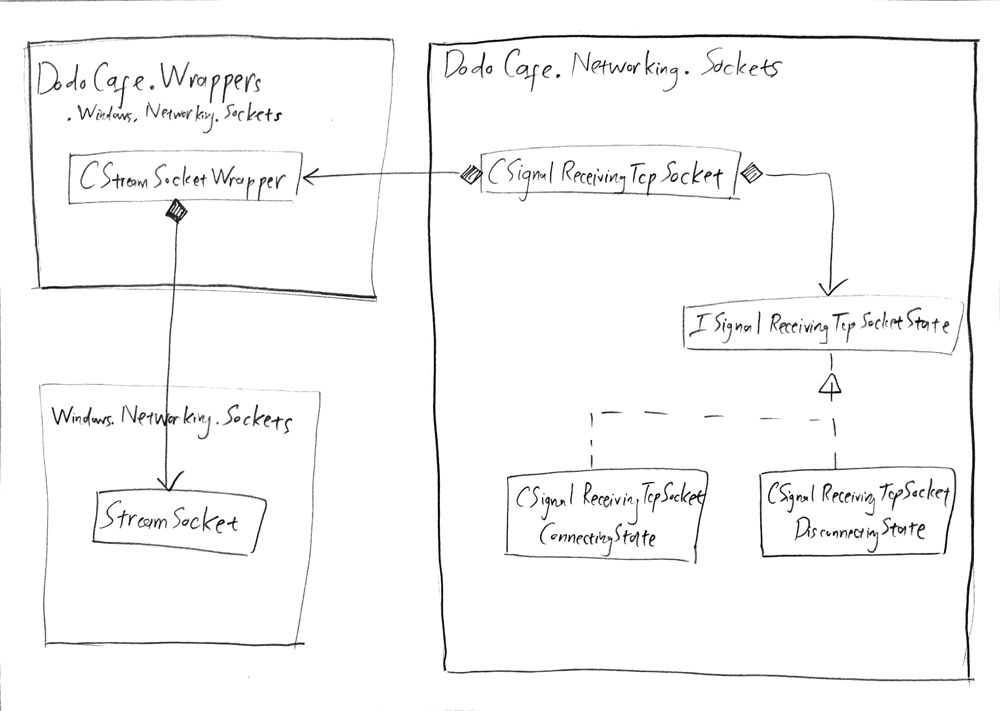

# Dodo Gallery
## Motivation
The world is moving fast, and so are we. With it, incredible civilization succeeds. But with it, spiritual value's left behind. Family, considered vital part of our life, is no doubt victim of the fast-moving modern world. *Dodo Gallery* was created to solve this problem. By letting each and every person go through three stages of interactive experience, the project aims to remind the user of family, urging him/her to take action and spend time to what is meant to value most.

## About
*Dodo Gallery* is a collaborated graduation project of six undergraduates from two departments of National Taipei University of Technology:
* Department of Interaction Design
* Department of Computer Science and Information Technology

The project was initiated in September 2019 and is expected to end in June 2021.
### Our Team
Our team name is [Dodo Cafe](https://github.com/DodoCafe).
#### Department of Interaction Design
* [106ac2016 王品筑](https://github.com/kai85559)
* 106ac1023 林秀靜
* 106ac2007 林恩雅

#### Department of Computer Science and Information Technology
* [106590040 温致綱](https://github.com/gougon)
* [106590048 陳風平](https://github.com/phogbinh)
* [106590026 高楷杰](https://github.com/mdvv85009)
* [106590018 廖彥澤](https://github.com/s88037zz) (Contract)

### Collaboration Story
Currently N/A.

### Interactive Experiences
Our main presentation method is to use the projection screen to project 3 pictures, just like a gallery.
* **First picture** 
When user walk close to the picture, the cellphone will start ring. Then user can pick up the cellphone and listen to the phonograph.  When the phonograph finished, the picture enter standby screen.
* **Second picture** 
User can use walking device(pressure sensor/macky macky) to moving for 15 seconds. After 15 seconds, the picture shows slogan and moving speed decrease to 0 in 5 seconds and enter standby screen.
* **Third picture** 
The picture is the foggy window. User can use hand to wipe the window.

### Implementation
Our main platform is PC and other device(pressure detect device, cellphone, infrared detect device, Kinect...).
* **First picture** 
We use infrared detect user's entering and inform the cellphone. The cellphone then start ringing. After user pick up the phone and listen to the phonograph, the cellphone will inform the PC. Then, PC goes to the second picture.
* **Second picture** 
When the first picture end, the second picture shows up. The picture prompts the user to tread on the walking device(pressure sensor/macky macky) which under his feet. User can move by tread the walking device, then computer will start count for 15 seconds. After 15 seconds, the picture shows slogan and moving speed decrease to 0 in 5 seconds and enter standby screen.
* **Third picture** 
When second picture over, the third picture start. We use Kinect to implement touch detection within a certain distance of the projection screen. User use this technic to wipe the fog out.
* **The skill in whole experience** 
We use face emotion recognition to dynamically detect user's emotion. Next picture will be affected by user's emotion.

#### Technologies
* **Android Unity Communication** 
We use Socket to accomplish this feature. The server and client use particular message to inform each other.
* **Kinect Depth Trigger** 
We use Kinect to get depth information and use median filter to reduce the noise.
* **3D FER** 
We use Kernel method + SVM and LSTM to recognize emotion.
* **Raspberry Pi TCP Infrared Motion Detection** 
We architect and implement infrared sensor multithreaded system which employs TCP socket to send sensor motion signal from Raspberry Pi to Unity desktop app.

#### Design Patterns
* **MVC**
    * We use this pattern in whole project
    * Motivation : We want to decoupling classes, keep code clean, and easy to read
    * Solution : MVC can accomplish these all factors
    * Consequence : 
        * Easy to maintain
        * Decoupling classes
        * The code need to go through multiple layer from base class to view
        * Decrease the efficiency
* **Android Unity Communication**
    1.  Observer
        * Motivation : We need a mechanism to that socket thread inform main thread what message it receive
        * Solution : Observer can avoid main thread busy wating
        * Consequense : 
            * Avoid busy waiting
            * Follow by MVC pattern, the observer need to go through multiple layer and generate readers and news
* **Signal Receiving TCP Socket** 
    1. State
        * Motivation：The socket is designed to have two states - Connecting and Disconnecting - and thus needs a mechanism to handle state transitions
        * Solution：State Pattern prevails the method of scattering state conditional statement across the class methods in tackling the proposed problem
        * Consequence：
            * It localizes state-specific behavior and partitions behavior for different
states
            * It makes state transitions explicit
        * Class Diagram：
* **Unity**
    1.  State
        * Motivation：We want the state of process can dynamic transfer to another
        * Solution：State Pattern can help us manage the transition of state easily.
        * Consequense：
            * Easy to manage code in each state
            * Easy to change the transitions of each state
            * Need to control the amount of state, because each addtional state must add a new class
            * Hard to limit "How to use" in program, each developer of group must follow the state machine rules
    2.  Singleton
        * Motivation：We only need one instance, which could let whole system can visit it.
        * Solution：Let the logic more clearly, don't need to care if the object is constructed. 
        * Consequense：
            * Provide only one method to create the singleton object, avoid a lot of mess.
            * Increase readability.
            * Increase debug difficulty, because everyone can access the object.

### Contributions
#### 陳風平
* Initiate collab with 3 Design Dept undergrads to form team of 6 creating an interactive experience themed home.
* Architect and implement infrared sensor multithreaded system which employs TCP socket to send sensor motion signal from Raspberry Pi to Unity desktop app.
* Technologies: C#, Python, UWP, MSTest, Unity 3D, Git, Asana.

### Source Codes
* [DodoCafe](https://github.com/DodoCafe/DodoCafe)
* [DodoCafePluginTest](https://github.com/DodoCafe/DodoCafePluginTest)
* [Raspberry Pi TCP Infrared Motion Detection](https://github.com/DodoCafe/raspberry-pi-tcp-infrared-motion-detection)
